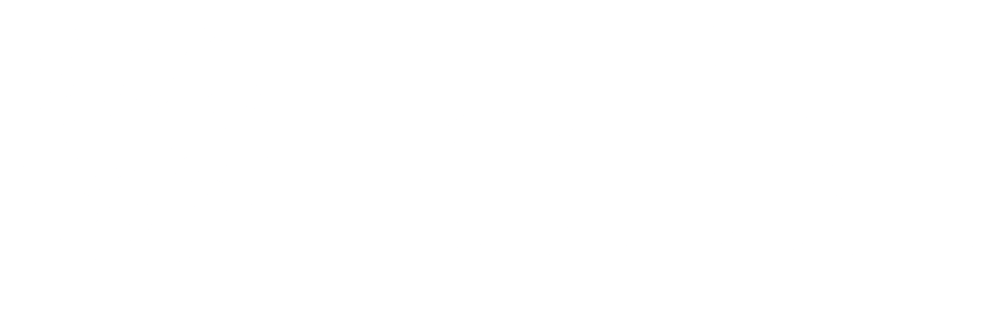

# CCSA Software, Modulo Programación Académica.

Este repositorio contiene el trabajo final de la asignatura "Proyecto integrador I". El objetivo de este proyecto es desarrollar una plataforma web para el "Centro Compartido de Servicios Académicos" (CCSA) centrada en el módulo "Programación Académica", cuyo alcance principal es facilitar la gestión académica de los programas de postgrado que se llevan a cabo en la universidad.

<!--- Aqui se iran agregando features a medida que se implementen.

 Features

  

    
&nbsp;
    

--->

## Colaboradores

